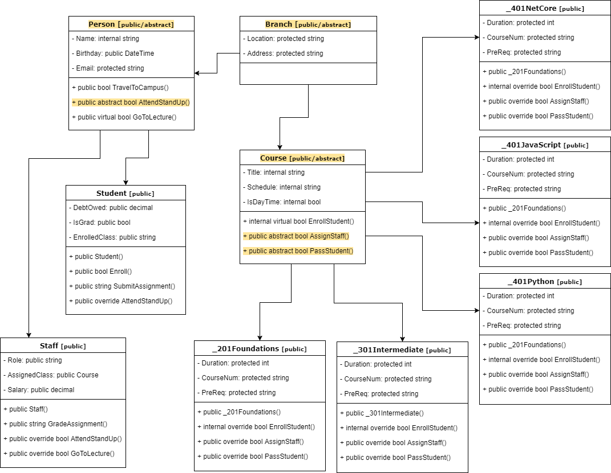

# CodeFellows Console App

**Author**: Ariel R. Pedraza <br />
**Version**: 1.0.0

## Overview
This application demonstrates OOP principles of Abstraction, Inheritance, Encapsulation, and Polymorphism.


## Getting Started
The following is required to run the program.
1. Visual Studio 2017 
2. The .NET desktop development workload enabled 

## Example
Simple test in main():
```
Student ariel = new Student("Seattle", "Ariel Pedraza", "pedrazaa2@gmail.com");
_401NetCore dotnet401d2 = new _401NetCore("Seattle", 10, "d2");
ariel.Enroll(dotnet401d2);
```
Output:
```
Checking the following pre-requisites: 301 Final Exam, 301 Final Project, Instructor Recommendation
Enrolling Ariel Pedraza in Advanced Software Development in ASP.NET Core
```

## Architecture
This application is created using ASP.NET Core 2.0 Console applicaitons. <br />
*Language*: C# <br />
*Type of Applicaiton*: Console Application <br />